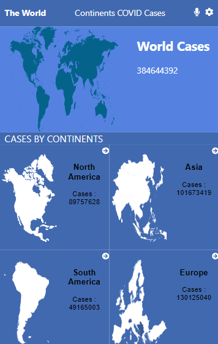
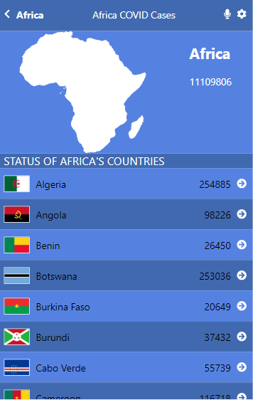

# Covid Tracker

> The Covid-19 Tracking Project collects information from different data sources to provide comprehensive data for the novel coronavirus, SARS-CoV-2, mobile web application to check a list of metrics. Built using React, Using [Covid-19 API](https://www.postman.com/postman/workspace/covid-19).

  
  

## Built With

- HTML
- CSS
- Javascript
- Webpacks
- React
- Redux
- API
## Live Demo

[Live Demo Link](https://covid-tracker-by-kero.netlify.app/)

## Video Demo

[Video Demo Link](https://www.loom.com/share/679811ba5e814f3e8fa302abd04bac01)
## Getting Started
To get a local copy up and running follow these simple example steps.

- Click on the top right green "code" button.
- On the dropdown menu, choose "download with zip" button.
- After download, extract the zip file and you have the project on your machine.
- After downloading run `npm i` to install all Node packages.
- Run `npm start` to run the project.

### Install

- Node
- npm

### Run tests
To launch the test runner in the interactive watch mode, run `$ npm test` in your console.
> To read more information about running tests, visit [create react app website](https://create-react-app.dev/docs/running-tests/);

## Authors

👤 **Kerolous Samy**

- GitHub: [@kerolous](https://github.com/keroloussamy)
- Twitter: [@kerolous](https://twitter.com/SamyKerolous)
- LinkedIn: [kerolous](https://www.linkedin.com/in/keroloussamy/)

## 🤝 Contributing

Contributions, issues, and feature requests are welcome!

Feel free to check the [issues page](../../issues/).

## Show your support

Give a ⭐️ if you like this project!

## Acknowledgments
- Original design idea by [Nelson Sakwa on Behance](https://www.behance.net/sakwadesignstudio).

## 📝 License

This project is [MIT](./MIT.md) licensed.